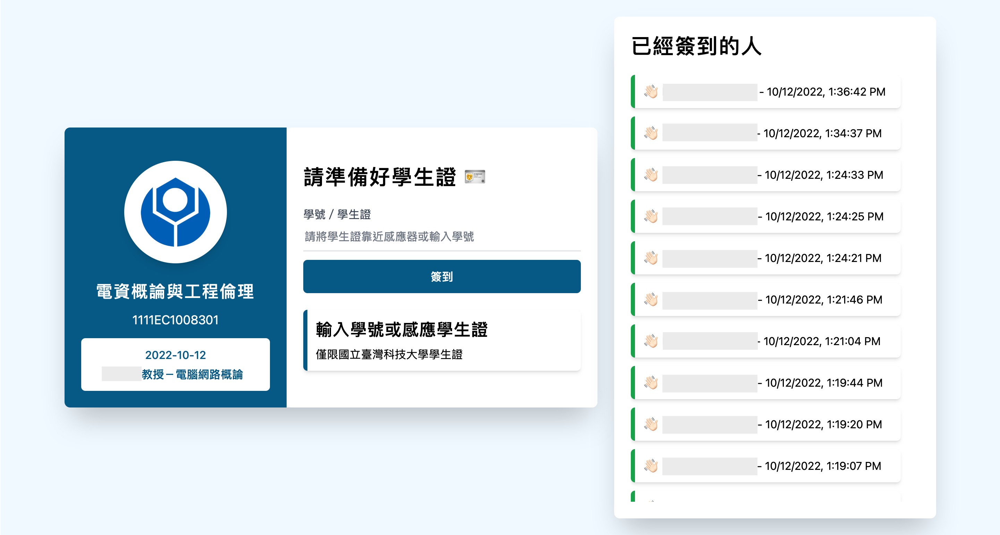

# NTUST-RollCall (Frontend)

This is a [Next.js](https://nextjs.org/) project for making roll calls in class at the National Taiwan University of Science and Technology.

Course manager/TA (call it users in the following) can create a class member list to make roll calls when it needs.

It supports users to record attendees by their student ID or their student card RFID code.



## Thanks

The user interface of this project is referenced to Max.

## Usage

In this project, it utilized [axios](https://github.com/axios/axios) to communicate to the backend, and [next-auth](https://next-auth.js.org) to handle user authentication.

It needs a backend server to provide service.

Visit [rollcall-backend](https://github.com/chiachunho/rollcall-backend) to learn more.

### Development

```bash
yarn dev
```

Open [http://localhost:3000](http://localhost:3000) with your browser to see the result.

### Deployment

This repository provides a docker-compose config to deploy this website if you need Nginx reverse proxy.

## Features to do

- [ ] Create/delete/edit/lookup Students at frontend
- [ ] Create/delete/edit/lookup Courses at frontend
- [ ] Delete/edit/lookup Events at frontend
- [ ] Delete/edit/lookup Records at frontend
- [ ] Add event closed time to auto-closed roll call event
- [ ] Add record double check for event check-out
